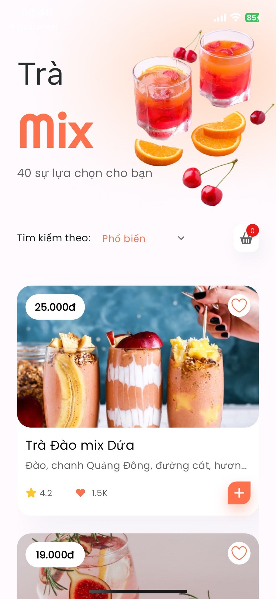
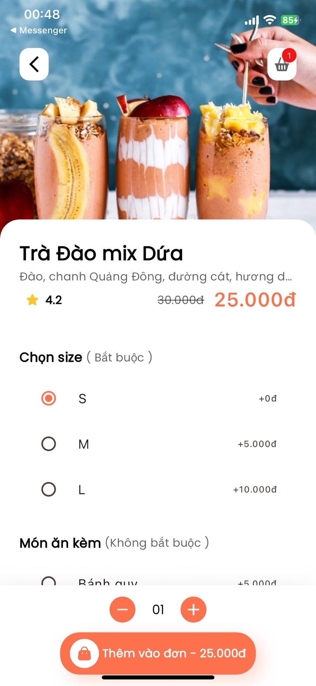

# Zens Test




## Getting Started

To get started with the project, follow these steps:

1. Clone the repository:

   ```bash
   git clone https://github.com/machuytu/zens-test.git
   ```

2. Install the required dependencies:

   ```bash
   flutter pub get
   ```

3. Run the project:

   ```bash
   flutter run
   ```

## State Management

The current state management approach in this project involves the use of StreamBuilder. StreamBuilder allows for reactive updates to the UI based on changes in the underlying data stream. However, SetState() is not being used in this project.

## MVVM Pattern

The MVVM (Model-View-ViewModel) pattern is being used to control the state management in this project. The project structure follows the MVVM pattern, with separate directories for models, view models, and views.

The models directory contains the data models used in the project. The view models directory contains the logic and state management for the views. And the views directory contains the UI components.

By using the MVVM pattern, the project achieves separation of concerns and improves maintainability and testability.

## Features

- Fetch data from json files in assets/json
- Click farvorite button
- Sort list drinks
- Add drink to cart
- Select options for order in cart
- Count price of order

## Contributing

Contributions are welcome! If you find any issues or have suggestions for improvements, please open an issue or submit a pull request on the [GitHub repository](https://github.com/machuytu/zens-test).

## License

This project is licensed under the [MIT License](LICENSE).

# References

- [ZenS flutter_evalutation_test link](https://github.com/khoitd253/flutter_evalutation_test/blob/main/README.md)
- [Figma UI](https://www.figma.com/file/RjeIVQXNsLaNMLKXRyLNYh/UI-Evaluation-Test---Mobile-team?type=design&node-id=0-1&mode=design&t=hFDgnDsjYY1eoXZP-0)
